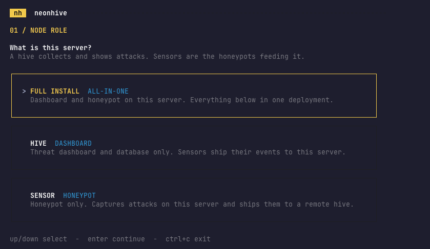
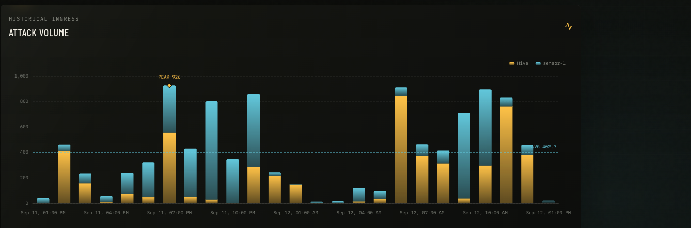
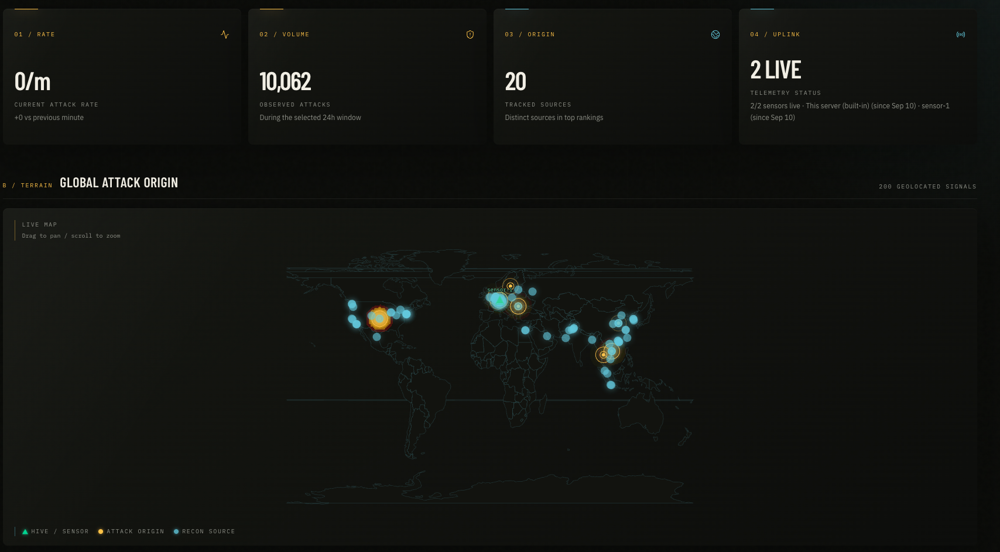
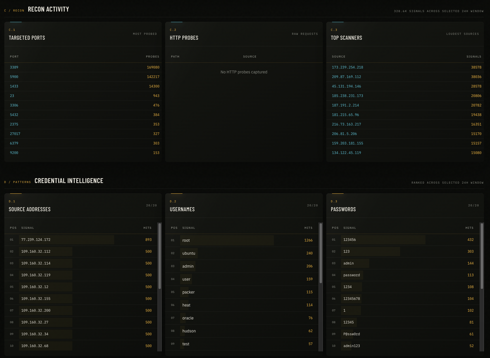
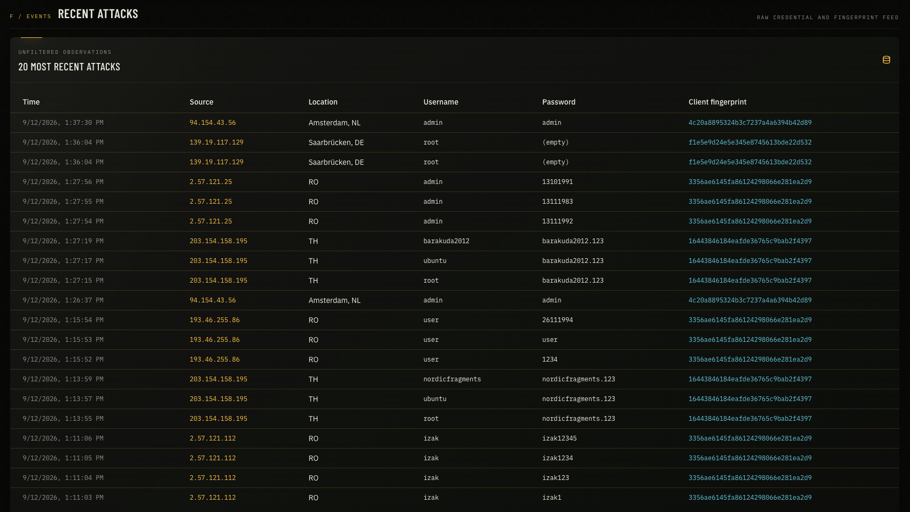
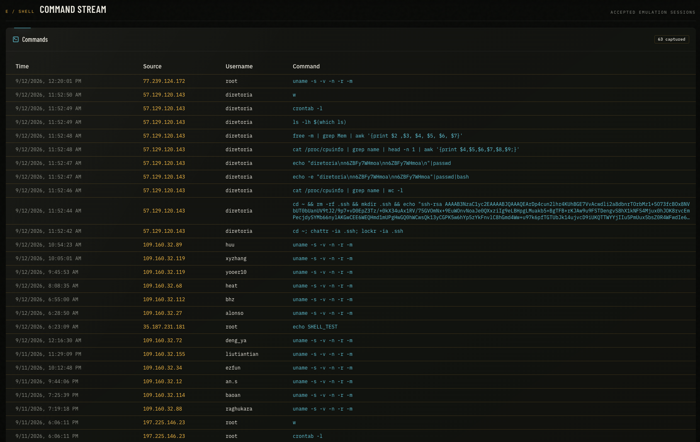

# neonhive

> **Run honeypots on purpose. Watch what happens.**

neonhive is a lightweight honeypot fleet with a live threat dashboard for
Linux servers. A fake SSH service answers on port 22 while your real SSH moves
to 3001 — every username, password, command, and client fingerprint lands on a
live ops dashboard. Service honeypots, decoy ports, and a raw-socket scan
sniffer widen the trap beyond SSH.

One server does everything, or split the roles: a **HIVE** runs the dashboard
and collects, **sensors** run the honeypots and ship their captures to it for
approval.

## Install

A single command launches the interactive installer:

```bash
curl -fsSL https://raw.githubusercontent.com/frnkst/neonhive/main/scripts/install.sh | sudo bash
```

The installer first asks what this server should be: **FULL** (dashboard and
honeypots on one server), **HIVE** (dashboard only), or **SENSOR** (honeypots
only, shipping captured attacks to a Hive). On FULL and SENSOR installs your
real SSH moves to port 3001 — keep the current session open and make sure your
provider firewall allows TCP **3001**.

The polished, one-command installer walks you through the right deployment for
your server—an all-in-one setup, a central Hive, or a remote Sensor.



## Dashboard

Approve joining sensors, watch attacks land in real time, and read exactly
what attackers tried to do — from any browser.

See attack volume at a glance, compare activity across the Hive and every
Sensor, and spot unusual peaks over time.



Inspect the latest login attempts with their source, location, credentials, and
SSH client fingerprint in one live feed.



Watch attacks and reconnaissance light up around the world while monitoring
the live status of the Hive and its connected Sensors.



Follow the live command stream to see exactly what attackers run after they
enter the emulated shell.



Turn raw reconnaissance into useful intelligence: see targeted ports, loudest
scanners, and the usernames and passwords attackers try most often.



## What gets detected

| Signal | Source |
| --- | --- |
| SSH login attempts, captured commands, and client fingerprints | Cowrie honeypot on port 22 |
| Port scans — SYN, NULL, FIN, XMAS, ACK — and ping sweeps | Raw-socket recon sniffer |
| Connections to decoy ports (Postgres, Elasticsearch, Docker API, MongoDB) | Built-in decoy listeners |
| Probes of MySQL, MSSQL, FTP, telnet, VNC, RDP, redis, NTP, and git | Opencanary service honeypots |
| Web scanner requests — paths, payloads, user agents | Opencanary HTTP on 8080, plus a catch-all for domain installs |

Recon sensors are enabled by default during installation and add roughly
250 MB of RAM on top of the base footprint.

## Server requirements

- Ubuntu 22.04, Ubuntu 24.04, or Debian 12
- 1 GB RAM, 1 vCPU, 8 GB free disk minimum
- A public IPv4 address
- Optional: a domain with an `A` record pointing to the server for trusted HTTPS
- Ports 22, 80, 443, and 3001 permitted by the provider firewall — recon
  sensors add a set of honeypot service ports
- Optional: a free [MaxMind GeoLite2 account ID and license key](https://www.maxmind.com/en/geolite2/signup)

## GeoLite2 setup

Advanced installation asks for the numeric **MaxMind account ID** and the
associated **license key** as separate values. neonhive uses both values for
HTTP Basic authentication when downloading the GeoLite2 City and ASN
databases. Do not enter the account password.

## Telegram setup

1. Create a bot with [@BotFather](https://t.me/BotFather) and copy its token.
2. Add the bot to the target channel as an administrator.
3. Use the numeric channel ID or an `@channel_name` as the chat ID.
4. Enter both values when the installer prompts.
