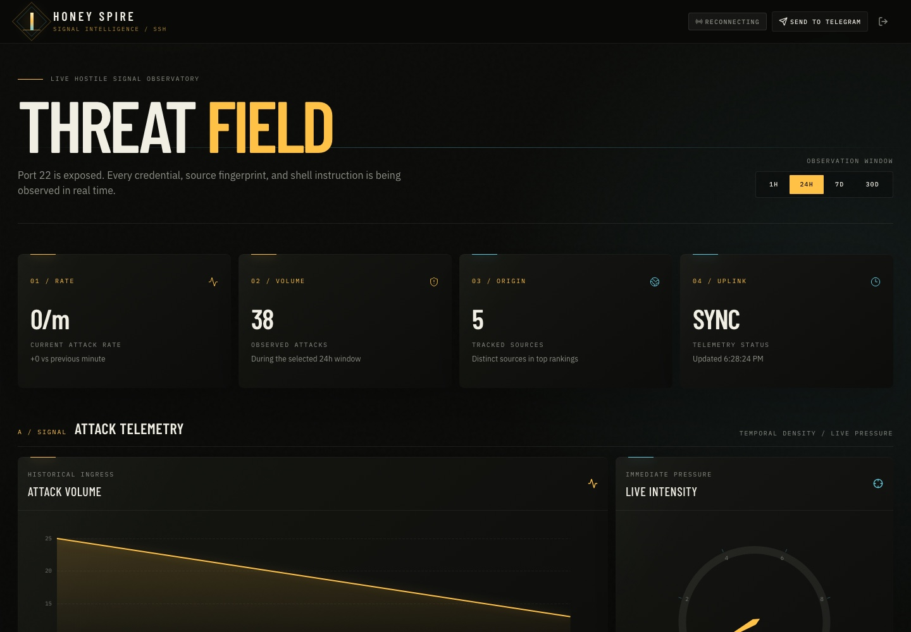
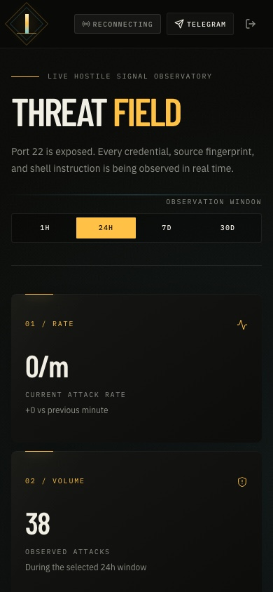

# Honey Spire

Honey Spire is a lightweight SSH honeypot and live threat dashboard designed for
a single Linux server with **1 GB RAM, 1 vCPU, and 25 GB storage**. Cowrie
emulates an SSH server on port 22 while the real host SSH service moves to port
3001.

Honey Spire can be installed in three topologies:

- **Full install** — dashboard and honeypot on one server. Everything below in a
  single deployment.
- **Tower** — the dashboard and its database only. Beecon honeypots on other
  servers ship their captured events to the tower over HTTPS.
- **Beecon** — a honeypot sensor with no dashboard. It registers with a tower,
  and once you approve it there, every captured attack flows to the tower.

The dashboard shows which beecons are live (with the display name you chose at
install time and the date they joined), how much each one has collected, and
lets you approve or remove them. A beecon whose access was removed stops
shipping and buffers nothing further.



<table>
  <tr>
    <td width="32%"><strong>Mobile operations view</strong></td>
    <td width="68%"><strong>Operator access</strong></td>
  </tr>
  <tr>
    <td></td>
    <td></td>
  </tr>
</table>

The dashboard includes:

- Current attacks per minute and an adaptive live gauge
- Historical attack volume charts
- A live world map when free MaxMind GeoLite2 enrichment is configured
- Top 20 source IPs, usernames, and passwords
- The 20 most recent credential attempts
- Up to ten commands from each accepted emulated session
- SSH client banners, HASSH fingerprints, and negotiated algorithms
- Detailed, configurable hourly, daily, and on-demand Telegram reports
- An authenticated **Send to Telegram** dashboard action

## Server requirements

- Ubuntu 22.04, Ubuntu 24.04, or Debian 12
- 1 GB RAM, 1 vCPU, 8 GB free disk minimum
- A public IPv4 address
- Optional: a domain with an `A` record pointing to the server for trusted HTTPS
- Ports 22, 80, 443, and 3001 permitted by the provider firewall
- Optional: a free [MaxMind GeoLite2 account ID and license key](https://www.maxmind.com/en/geolite2/signup)

## Install

Keep your current SSH session open throughout installation. Confirm that your
cloud provider firewall allows TCP port **3001** before running the command.

```bash
curl -fsSL https://raw.githubusercontent.com/frnkst/honey-spire/main/scripts/install.sh | sudo bash
```

The installer first asks what this server should be: **full**, **tower**, or
**beecon**.

### Full install (honeypot + dashboard on one server)

Continue through quick or advanced setup. Before closing the original
connection, open another terminal and verify:

```bash
ssh -p 3001 your-user@your-domain-or-ip
```

The honeypot is available to scanners on port 22. The dashboard is available at
`https://your-domain.example` with a domain, or `http://your-server-ip` without
one. Captured attacks appear on the dashboard as the built-in *this server*
beecon.

### Tower install (dashboard only)

Choose **TOWER** and continue through quick or advanced setup. The tower
requires a domain or a public IP so beecons can reach it. The real SSH daemon
is left untouched on port 22; no honeypot runs on the tower.

### Beecon install (honeypot only)

Choose **BEECON**. The installer asks for:

1. **Tower address** — the tower's domain or IP (for example
   `tower.example.com`). The installer contacts the tower to verify it is
   reachable before continuing.
2. **Display name** — the name shown on the tower's dashboard and in the join
   request.

The installer submits a join request and finishes immediately; it does not wait
for approval. On the tower, the dashboard shows
*"Beecon your-name wants to join this tower"* — approve it, and the beecon
starts shipping captured attacks. Until then (and if the tower is unreachable),
the beecon buffers and retries on its own. Like the full install, the beecon
moves real SSH to port 3001 and exposes the honeypot on port 22.

Review remote scripts before executing them if required by your security
policy.

## GeoLite2 setup

Advanced installation asks for the numeric **MaxMind account ID** and the
associated **license key** as separate values. Honey Spire uses both values for
HTTP Basic authentication when downloading the GeoLite2 City and ASN
databases. Do not enter the account password.

## Telegram setup

1. Create a bot with [@BotFather](https://t.me/BotFather) and copy its token.
2. Add the bot to the target channel as an administrator.
3. Use the numeric channel ID or an `@channel_name` as the chat ID.
4. Enter both values when the installer prompts.

### SSH recovery

The installer saves the original SSH configuration under
`/var/backups/honey-spire-ssh-*`. If port 3001 is inaccessible, use the
provider's web console, restore `sshd_config` and `sshd_config.d` from the
latest backup, run `sshd -t`, then restart `ssh` or `sshd`.

### Uninstall

First restore the real SSH service to port 22 and verify it. Then stop the
stack:

```bash
cd /opt/honey-spire
sudo docker compose down
```

Add `--volumes` only when you intentionally want to permanently delete all
attack data and Caddy certificates.