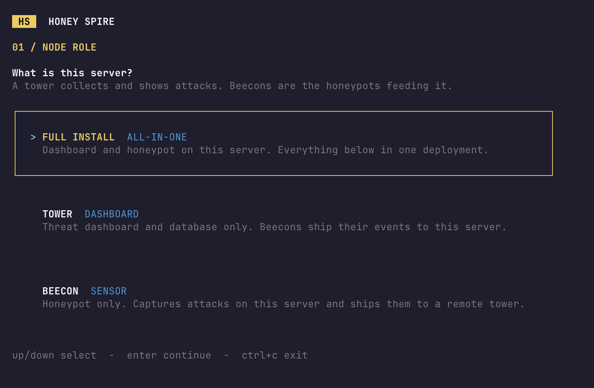
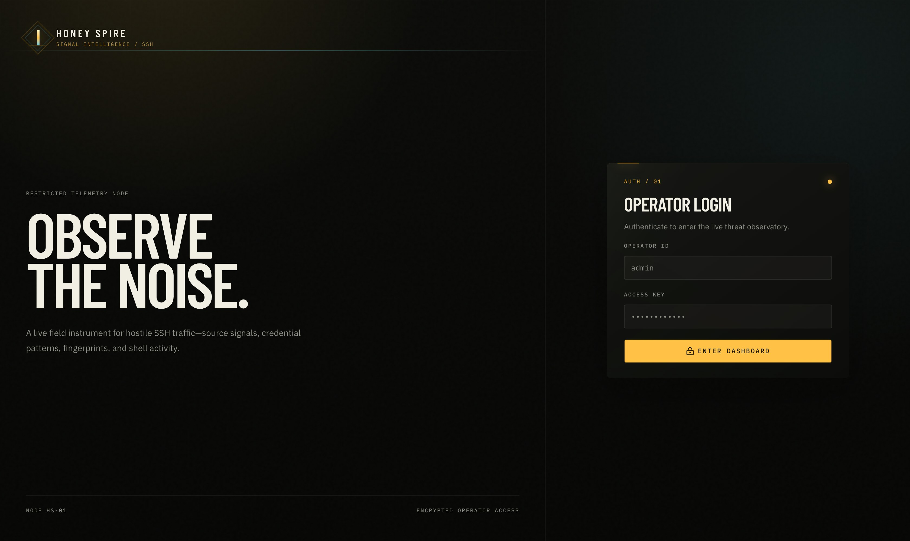
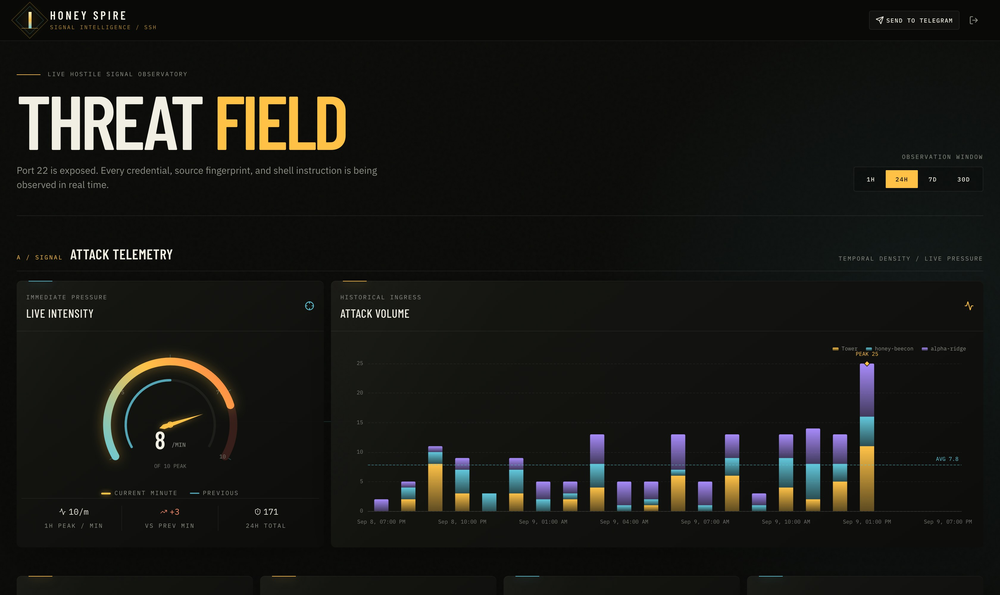
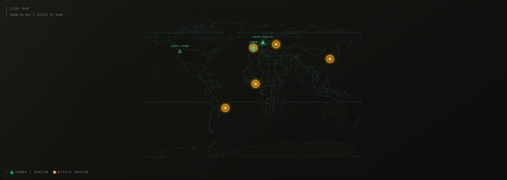
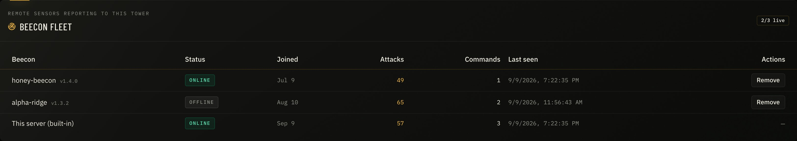

# 🍯 Honey Spire

> **Open port 22 on purpose. Watch what happens.**

Honey Spire is a lightweight SSH honeypot and live threat dashboard for a single
Linux server. Cowrie answers on port 22 while your real SSH service moves to
3001 — every username, password, command, and client fingerprint lands on a
live ops dashboard.

## Install

A single command launches the interactive installer:

```bash
curl -fsSL https://raw.githubusercontent.com/frnkst/honey-spire/main/scripts/install.sh | sudo bash
```

Keep your current SSH session open throughout, and make sure your provider
firewall allows TCP port **3001** — that is where your real SSH ends up.

The installer first asks what this server should be: **FULL** (dashboard and
honeypot on one server), **TOWER** (dashboard only, beecons ship their events
to it), or **BEECON** (a honeypot sensor with no dashboard that ships captured
attacks to a tower for approval).



## Dashboard

Approve beecons, watch attacks land in real time, and read exactly what
attackers tried to do — from any browser.









## Server requirements

- Ubuntu 22.04, Ubuntu 24.04, or Debian 12
- 1 GB RAM, 1 vCPU, 8 GB free disk minimum
- A public IPv4 address
- Optional: a domain with an `A` record pointing to the server for trusted HTTPS
- Ports 22, 80, 443, and 3001 permitted by the provider firewall
- Optional: a free [MaxMind GeoLite2 account ID and license key](https://www.maxmind.com/en/geolite2/signup)

## GeoLite2 setup

Advanced installation asks for the numeric **MaxMind account ID** and the
associated **license key** as separate values. Honey Spire uses both values for
HTTP Basic authentication when downloading the GeoLite2 City and ASN
databases. Do not enter the account password.

## Telegram setup

1. Create a bot with [@BotFather](https://t.me/BotFather) and copy its token.
2. Add the bot to the target channel as an administrator.
3. Use the numeric channel ID or an `@channel_name` as the chat ID.
4. Enter both values when the installer prompts.
